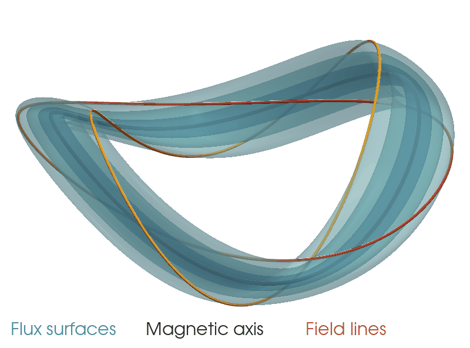
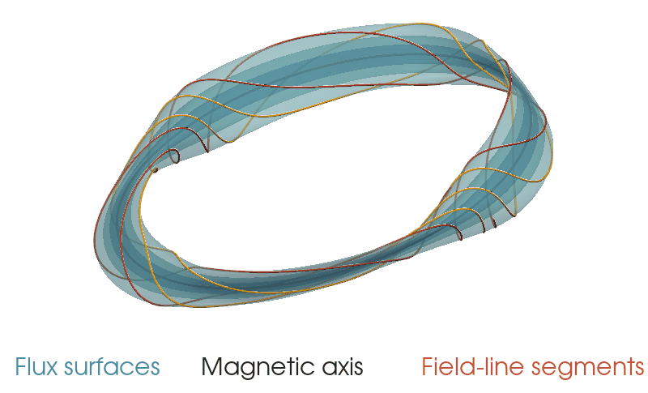

# Analytic 3D MHD equilibria

This repository contains supplemental files for the paper
[Analytic toroidal 3D MHD equilibria and steady Euler flows with invariant surfaces, M Landreman, arXiv:2609.26742](https://arxiv.org/abs/2609.26742)

This paper and repository describe explicit analytic 3D solutions of the magnetohydrodynamic equilibrium equations, equivalent to steady incompressible Euler flow.
The solutions employ toroidal geometry, are non-axisymmetric, and possess exact nested toroidal flux surfaces.
No expansion is made in inverse aspect ratio or in the deviation from axisymmetry.
The magnetic field and flux surfaces are given explicitly in Cartesian coordinates using elementary functions.
The field, current density, and scalar pressure are smooth over the toroidal domain.
The pressure gradient vanishes only on the magnetic axis.
One family of solutions has uniform rotational transform iota=2, while another family has a sheared iota profile.
These counterexamples to Grad's conjecture are valuable for understanding the
existence and regularity of 3D equilibria and for testing numerical codes.

## Iota = 2 family:

## Sheared iota family:

The two subdirectories `iota_2` and `sheared_iota` correspond to the two
families of solutions in the paper.

Each directory contains:
* The python script used to generate the figures in the paper.
* A script that generates a DESC equilibrium, checking that many quantities
  match between the numerical equilibrium and the analytic expressions in the
  paper.
* The corresponding DESC equilibrium file (HDF5 format, `*.h5`).
* Notebooks that confirm ∇⋅B = 0, B⋅∇ψ = 0, and (∇×B)×B = ∇p, using the explicit
  formulas for B, ψ, and p.
* Additional scripts for plotting the solutions.
* The original prompt and chat with GPT-6 Astra Pro with which the solutions
  were discovered.

The 3D plotting scripts use the `pyvista` package, and the DESC scripts use the
package `desc-opt`.